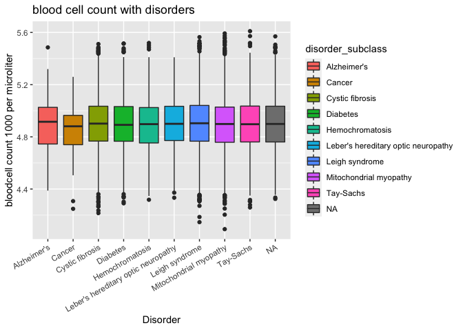

##Source
- [Data](https://www.kaggle.com/brsdincer/genomes-and-genetics-disorder-prediction-ii/data)
- [Picture Map](https://bostonography.com/wp-content/uploads/2012/01/density2.jpg)


```r
library(tidyverse)
```

```
## ── Attaching packages ─────────────────────────────────────── tidyverse 1.3.1 ──
```

```
## ✓ ggplot2 3.3.5     ✓ purrr   0.3.4
## ✓ tibble  3.1.6     ✓ dplyr   1.0.8
## ✓ tidyr   1.2.0     ✓ stringr 1.4.0
## ✓ readr   2.1.2     ✓ forcats 0.5.1
```

```
## Warning: package 'tidyr' was built under R version 4.0.5
```

```
## Warning: package 'readr' was built under R version 4.0.5
```

```
## Warning: package 'dplyr' was built under R version 4.0.5
```

```
## ── Conflicts ────────────────────────────────────────── tidyverse_conflicts() ──
## x dplyr::filter() masks stats::filter()
## x dplyr::lag()    masks stats::lag()
```

```r
library(janitor)
```

```
## 
## Attaching package: 'janitor'
```

```
## The following objects are masked from 'package:stats':
## 
##     chisq.test, fisher.test
```

```r
library(here)
```

```
## here() starts at /Users/breadhom/Desktop/BIS15LW2022group5/Group 5 project
```

```r
library(naniar)
library(ggthemes)
library(RColorBrewer)
library(reshape2)
```

```
## 
## Attaching package: 'reshape2'
```

```
## The following object is masked from 'package:tidyr':
## 
##     smiths
```

```r
library(ggVennDiagram)
library(ggwordcloud)
library(ggthemes)
library(albersusa)
library(ggmap)
```

```
## Google's Terms of Service: https://cloud.google.com/maps-platform/terms/.
```

```
## Please cite ggmap if you use it! See citation("ggmap") for details.
```

```r
train <- read_csv('../data/train.csv')
```

```
## Rows: 22083 Columns: 45
## ── Column specification ────────────────────────────────────────────────────────
## Delimiter: ","
## chr (29): Patient Id, Genes in mother's side, Inherited from father, Materna...
## dbl (16): Patient Age, Blood cell count (mcL), Mother's age, Father's age, T...
## 
## ℹ Use `spec()` to retrieve the full column specification for this data.
## ℹ Specify the column types or set `show_col_types = FALSE` to quiet this message.
```

```r
test <- read_csv('../data/test.csv')
```

```
## Rows: 9465 Columns: 43
## ── Column specification ────────────────────────────────────────────────────────
## Delimiter: ","
## chr (27): Patient Id, Genes in mother's side, Inherited from father, Materna...
## dbl (11): Patient Age, Blood cell count (mcL), Mother's age, Father's age, T...
## lgl  (5): Symptom 1, Symptom 2, Symptom 3, Symptom 4, Symptom 5
## 
## ℹ Use `spec()` to retrieve the full column specification for this data.
## ℹ Specify the column types or set `show_col_types = FALSE` to quiet this message.
```


```r
# cleaning bad column nanes
train <- clean_names(train)
train
```

```
## # A tibble: 22,083 × 45
##    patient_id patient_age genes_in_mothers_side inherited_from_fa… maternal_gene
##    <chr>            <dbl> <chr>                 <chr>              <chr>        
##  1 PID0x6418            2 Yes                   No                 Yes          
##  2 PID0x25d5            4 Yes                   Yes                No           
##  3 PID0x4a82            6 Yes                   No                 No           
##  4 PID0x4ac8           12 Yes                   No                 Yes          
##  5 PID0x1bf7           11 Yes                   No                 <NA>         
##  6 PID0x44fe           14 Yes                   No                 Yes          
##  7 PID0x28de            3 Yes                   No                 Yes          
##  8 PID0x4f8f            3 No                    No                 Yes          
##  9 PID0x8ce3           11 No                    No                 Yes          
## 10 PID0x8660            4 No                    Yes                Yes          
## # … with 22,073 more rows, and 40 more variables: paternal_gene <chr>,
## #   blood_cell_count_mc_l <dbl>, patient_first_name <chr>, family_name <chr>,
## #   fathers_name <chr>, mothers_age <dbl>, fathers_age <dbl>,
## #   institute_name <chr>, location_of_institute <chr>, status <chr>,
## #   respiratory_rate_breaths_min <chr>, heart_rate_rates_min <chr>,
## #   test_1 <dbl>, test_2 <dbl>, test_3 <dbl>, test_4 <dbl>, test_5 <dbl>,
## #   parental_consent <chr>, follow_up <chr>, gender <chr>, …
```


```r
columns_to_drop <- c('patient_id','patient_first_name','family_name','fathers_name','test_1','test_2','test_3','test_4','test_5','symptom_1','symptom_2','symptom_3','symptom_4','symptom_5')
```

```r
train_1 <- train[!colnames(train) %in% columns_to_drop]
```

```r
table(train['disorder_subclass'])
```

```
## 
##                         Alzheimer's                              Cancer 
##                                 152                                  97 
##                     Cystic fibrosis                            Diabetes 
##                                3448                                1817 
##                     Hemochromatosis Leber's hereditary optic neuropathy 
##                                1355                                 648 
##                      Leigh syndrome              Mitochondrial myopathy 
##                                5160                                4405 
##                           Tay-Sachs 
##                                2833
```


```r
table(train['genetic_disorder'])
```

```
## 
##  Mitochondrial genetic inheritance disorders 
##                                        10202 
## Multifactorial genetic inheritance disorders 
##                                         2071 
##             Single-gene inheritance diseases 
##                                         7664
```

```r
train_1[train_1=="Not applicable"] <- NA
train_1[train_1=="-"] <- NA
```

```r
cols <- brewer.pal(3, "Pastel2")
```


The dataset seems to contain an equal amount for each gender. 


```r
train_1 %>% 
  filter(!is.na(gender)) %>% 
  ggplot(aes(x=gender))+
  geom_bar(aes(fill=gender),col='black')+
  labs(title="Count of Gender",
       x="Gender",
       y="Count")+
  theme_light()+
  theme(axis.title = element_text(size=15),
        axis.text = element_text(size=10),
        plot.title = element_text(hjust = .5, size = 15))+
  scale_fill_brewer(palette="Set2")
```

<!-- -->

```r
gender_disorder <- train_1 %>% 
  filter(!is.na(gender)& !is.na(genetic_disorder)) %>% 
  group_by(gender) %>% 
  count(genetic_disorder)
gender_disorder
```

```
## # A tibble: 9 × 3
## # Groups:   gender [3]
##   gender    genetic_disorder                                 n
##   <chr>     <chr>                                        <int>
## 1 Ambiguous Mitochondrial genetic inheritance disorders   3099
## 2 Ambiguous Multifactorial genetic inheritance disorders   670
## 3 Ambiguous Single-gene inheritance diseases              2299
## 4 Female    Mitochondrial genetic inheritance disorders   3096
## 5 Female    Multifactorial genetic inheritance disorders   600
## 6 Female    Single-gene inheritance diseases              2270
## 7 Male      Mitochondrial genetic inheritance disorders   3050
## 8 Male      Multifactorial genetic inheritance disorders   631
## 9 Male      Single-gene inheritance diseases              2378
```

```r
cols <- brewer.pal(3, "Dark2")
gender_disorder %>% 
  ggplot(aes(x=gender,y=n))+
  geom_col(aes(fill=genetic_disorder),position = 'dodge',col='black')+
  scale_fill_manual(values = cols)+
  theme_classic()+
  labs(title="Count of Genetic Disorders By Gender",
       x="Gender",
       y="Count")+
  theme(axis.title = element_text(size=15),
        axis.text = element_text(size=10),
        plot.title = element_text(hjust = .5, size = 15))
```

<!-- -->


```r
gender_subclass <- train_1 %>% 
  filter(!is.na(gender)&!is.na(disorder_subclass)) %>% 
  group_by(gender) %>% 
  count(disorder_subclass)
gender_subclass
```

```
## # A tibble: 27 × 3
## # Groups:   gender [3]
##    gender    disorder_subclass                       n
##    <chr>     <chr>                               <int>
##  1 Ambiguous Alzheimer's                            46
##  2 Ambiguous Cancer                                 33
##  3 Ambiguous Cystic fibrosis                      1062
##  4 Ambiguous Diabetes                              586
##  5 Ambiguous Hemochromatosis                       388
##  6 Ambiguous Leber's hereditary optic neuropathy   202
##  7 Ambiguous Leigh syndrome                       1547
##  8 Ambiguous Mitochondrial myopathy               1315
##  9 Ambiguous Tay-Sachs                             865
## 10 Female    Alzheimer's                            55
## # … with 17 more rows
```

```r
gender_subclass %>% 
  ggplot(aes(x=gender,y=disorder_subclass,fill=n),col='black')+
  geom_tile()+
  scale_fill_gradient(low="white", high="red")+
  theme_bw()+
  labs(title="Heatmap of Genetic Disorders Subclass By Gender",
       x="Gender",
       y="Disorder Subclass")+
  theme(axis.title = element_text(size=15),
        axis.text = element_text(size=10),
        plot.title = element_text(hjust = .5, size = 15))
```

<!-- -->

```r
gender_subclass <- gender_subclass %>% 
  group_by(disorder_subclass) %>% 
  mutate(max=max(n),min=min(n)) %>% 
  mutate(max_scaled=n/max,min_scaled=n/min)

gender_subclass
```

```
## # A tibble: 27 × 7
## # Groups:   disorder_subclass [9]
##    gender    disorder_subclass               n   max   min max_scaled min_scaled
##    <chr>     <chr>                       <int> <int> <int>      <dbl>      <dbl>
##  1 Ambiguous Alzheimer's                    46    55    38      0.836       1.21
##  2 Ambiguous Cancer                         33    33    29      1           1.14
##  3 Ambiguous Cystic fibrosis              1062  1062  1005      1           1.06
##  4 Ambiguous Diabetes                      586   586   522      1           1.12
##  5 Ambiguous Hemochromatosis               388   430   388      0.902       1   
##  6 Ambiguous Leber's hereditary optic n…   202   205   190      0.985       1.06
##  7 Ambiguous Leigh syndrome               1547  1594  1512      0.971       1.02
##  8 Ambiguous Mitochondrial myopathy       1315  1392  1288      0.945       1.02
##  9 Ambiguous Tay-Sachs                     865   865   835      1           1.04
## 10 Female    Alzheimer's                    55    55    38      1           1.45
## # … with 17 more rows
```

```r
gender_subclass %>% 
  ggplot(aes(x=gender,y=disorder_subclass,fill=max_scaled))+
  geom_tile()+
  scale_fill_gradient(low="white", high="red")+
  theme_bw()+
  labs(title="Heatmap of Genetic Disorders Subclass By Gender",
       x="Gender",
       y="Disorder Subclass")+
  theme(axis.title = element_text(size=15),
        axis.text = element_text(size=10),
        plot.title = element_text(hjust = .5, size = 15))
```

<!-- -->


```r
train_1 %>% 
  group_by(genes_in_mothers_side,inherited_from_father,maternal_gene,paternal_gene) %>% 
  count(disorder_subclass)
```

```
## # A tibble: 312 × 6
## # Groups:   genes_in_mothers_side, inherited_from_father, maternal_gene,
## #   paternal_gene [36]
##    genes_in_mothers_side inherited_from_father maternal_gene paternal_gene
##    <chr>                 <chr>                 <chr>         <chr>        
##  1 No                    No                    No            No           
##  2 No                    No                    No            No           
##  3 No                    No                    No            No           
##  4 No                    No                    No            No           
##  5 No                    No                    No            No           
##  6 No                    No                    No            No           
##  7 No                    No                    No            No           
##  8 No                    No                    No            No           
##  9 No                    No                    No            No           
## 10 No                    No                    No            Yes          
## # … with 302 more rows, and 2 more variables: disorder_subclass <chr>, n <int>
```

```r
inheritance_traits <- train_1 %>% 
  filter(!is.na(genetic_disorder) & !is.na(disorder_subclass)) %>% 
  group_by(genetic_disorder) %>% 
  distinct(disorder_subclass) %>% 
  arrange(genetic_disorder)
knitr::kable(inheritance_traits)
```


|genetic_disorder                             |disorder_subclass                   |
|:--------------------------------------------|:-----------------------------------|
|Mitochondrial genetic inheritance disorders  |Leber's hereditary optic neuropathy |
|Mitochondrial genetic inheritance disorders  |Leigh syndrome                      |
|Mitochondrial genetic inheritance disorders  |Mitochondrial myopathy              |
|Multifactorial genetic inheritance disorders |Diabetes                            |
|Multifactorial genetic inheritance disorders |Cancer                              |
|Multifactorial genetic inheritance disorders |Alzheimer's                         |
|Single-gene inheritance diseases             |Cystic fibrosis                     |
|Single-gene inheritance diseases             |Tay-Sachs                           |
|Single-gene inheritance diseases             |Hemochromatosis                     |

```r
train_1 %>% 
ggplot(aes(x=disorder_subclass, fill=h_o_radiation_exposure_x_ray)) + geom_bar(position="dodge") +
theme(axis.text.x = element_text(angle = 40, hjust = 1, vjust = 1)) +
labs(title = "Disorder Frequency by Radiation Exposure", 
     x = "Disorder Type",
     y = "Number of Observation")
```

<!-- -->


```r
train_1 %>% 
  filter(!is.na(patient_age)&!is.na(disorder_subclass)) %>% 
  ggplot(aes(x=disorder_subclass,y=patient_age,fill=disorder_subclass))+
  geom_boxplot()+
  geom_violin(alpha=.1)+
  coord_flip()
```

<!-- -->


```r
train_1 %>% 
  filter(!is.na(disorder_subclass)) %>% 
  group_by(disorder_subclass) %>% 
  summarise(n=n()) %>% 
  ggplot(aes(x=disorder_subclass,y=n))+
  geom_col(aes(fill=disorder_subclass),col='black')+
  coord_flip()+  
  theme_classic()+
  labs(title="Count of Genetic Disorders",
       x="Disorder Sublcass",
       y="Count")+
  theme(axis.title = element_text(size=15),
        axis.text = element_text(size=10),
        plot.title = element_text(hjust = .5, size = 15))
```

<!-- -->


```r
train_1 %>% 
  filter(!is.na(genetic_disorder)) %>% 
  group_by(genetic_disorder) %>% 
  summarise(n=n()) %>% 
  ggplot(aes(x=genetic_disorder,y=n))+
  geom_col(aes(fill=genetic_disorder))+
  theme_classic()+
  labs(title="Count of Genetic Disorders",
       x="Disorder",
       y="Count")+
  theme(axis.title = element_text(size=15),
        axis.text = element_text(size=10),
        plot.title = element_text(hjust = .5, size = 15))+
  theme(axis.text.x = element_text(angle = 60, hjust = 1, vjust = 1)) 
```

<!-- -->


```r
numerical_vals <- train_1 %>% 
  select(patient_age,blood_cell_count_mc_l,mothers_age,fathers_age,white_blood_cell_count_thousand_per_microliter,no_of_previous_abortion) %>% na.omit()
```


```r
train_1 %>% 
  filter(!is.na(mothers_age)&!is.na(disorder_subclass)) %>% 
  ggplot(aes(x=disorder_subclass,y=mothers_age,fill=disorder_subclass))+
  geom_boxplot()+
  geom_violin(alpha=.1)+
  coord_flip()
```

<!-- -->


```r
train_1 %>% 
  filter(!is.na(fathers_age)&!is.na(disorder_subclass)) %>% 
  ggplot(aes(x=disorder_subclass,y=fathers_age,fill=disorder_subclass))+
  geom_boxplot()+
  geom_violin(alpha=.1)+
  coord_flip()
```

<!-- -->

`

```r
train_1
```

```
## # A tibble: 22,083 × 31
##    patient_age genes_in_mothers_si… inherited_from_… maternal_gene paternal_gene
##          <dbl> <chr>                <chr>            <chr>         <chr>        
##  1           2 Yes                  No               Yes           No           
##  2           4 Yes                  Yes              No            No           
##  3           6 Yes                  No               No            No           
##  4          12 Yes                  No               Yes           No           
##  5          11 Yes                  No               <NA>          Yes          
##  6          14 Yes                  No               Yes           No           
##  7           3 Yes                  No               Yes           Yes          
##  8           3 No                   No               Yes           Yes          
##  9          11 No                   No               Yes           No           
## 10           4 No                   Yes              Yes           Yes          
## # … with 22,073 more rows, and 26 more variables: blood_cell_count_mc_l <dbl>,
## #   mothers_age <dbl>, fathers_age <dbl>, institute_name <chr>,
## #   location_of_institute <chr>, status <chr>,
## #   respiratory_rate_breaths_min <chr>, heart_rate_rates_min <chr>,
## #   parental_consent <chr>, follow_up <chr>, gender <chr>,
## #   birth_asphyxia <chr>, autopsy_shows_birth_defect_if_applicable <chr>,
## #   place_of_birth <chr>, folic_acid_details_peri_conceptional <chr>, …
```


```r
train_1
```

```
## # A tibble: 22,083 × 31
##    patient_age genes_in_mothers_si… inherited_from_… maternal_gene paternal_gene
##          <dbl> <chr>                <chr>            <chr>         <chr>        
##  1           2 Yes                  No               Yes           No           
##  2           4 Yes                  Yes              No            No           
##  3           6 Yes                  No               No            No           
##  4          12 Yes                  No               Yes           No           
##  5          11 Yes                  No               <NA>          Yes          
##  6          14 Yes                  No               Yes           No           
##  7           3 Yes                  No               Yes           Yes          
##  8           3 No                   No               Yes           Yes          
##  9          11 No                   No               Yes           No           
## 10           4 No                   Yes              Yes           Yes          
## # … with 22,073 more rows, and 26 more variables: blood_cell_count_mc_l <dbl>,
## #   mothers_age <dbl>, fathers_age <dbl>, institute_name <chr>,
## #   location_of_institute <chr>, status <chr>,
## #   respiratory_rate_breaths_min <chr>, heart_rate_rates_min <chr>,
## #   parental_consent <chr>, follow_up <chr>, gender <chr>,
## #   birth_asphyxia <chr>, autopsy_shows_birth_defect_if_applicable <chr>,
## #   place_of_birth <chr>, folic_acid_details_peri_conceptional <chr>, …
```


```r
 numerical_vals <- train_1 %>% 
  rename(blood_cell_count=blood_cell_count_mc_l,white_cell_count=white_blood_cell_count_thousand_per_microliter) %>% 
  select(patient_age,blood_cell_count,mothers_age,fathers_age,white_cell_count,no_of_previous_abortion)%>% 
  na.omit()
```


```r
melt_cor <- melt(cor(numerical_vals))
melt_cor %>% 
  ggplot(aes(x=Var1,y=Var2,fill=value))+
  geom_tile()+
  scale_fill_gradient(low="white", high="red")+
  theme(axis.text.x = element_text(angle = 20, hjust = 1, vjust = 1)) +
  labs(title="Corrlation heatmap of numerical variables")+
  theme(axis.title = element_text(size=15),
        axis.text = element_text(size=10),
        plot.title = element_text(hjust = .5, size = 15))
```

<!-- -->


```r
#Cleaning Location Column
location_data_train_1 <- train_1 %>% 
  mutate(New = str_extract(location_of_institute, "\\([^\\)]+"),
               New = str_remove(New, "\\("),
               location_of_institute = str_extract(location_of_institute,"^[^\\(]+"),
               location_of_institute = New) %>%
  separate(location_of_institute, into = c("loc_lat", "loc_long"), sep = ",")
```


```r
#Only work around I found to work to turn lat/long character -> numeric. Piping into above chunk wouldn't work
location_data_train_1$loc_lat = as.numeric(as.character(location_data_train_1$loc_lat))
location_data_train_1$loc_long = as.numeric(as.character(location_data_train_1$loc_long))
```


```r
#Finding bbox
location_data_train_1 %>%
  select(loc_lat, loc_long) %>%
  summary()
```

```
##     loc_lat         loc_long     
##  Min.   :42.27   Min.   :-71.17  
##  1st Qu.:42.31   1st Qu.:-71.11  
##  Median :42.34   Median :-71.11  
##  Mean   :42.33   Mean   :-71.10  
##  3rd Qu.:42.35   3rd Qu.:-71.07  
##  Max.   :42.37   Max.   :-71.06  
##  NA's   :10931   NA's   :10931
```

```r
#making bbox
latitude <- c(42.27, 42.37)
longitude <- c(-71.17, -71.06)
bbox2 <- make_bbox(longitude, latitude, f = 0.05)
```


```r
#Finding Frequency
location_map <- location_data_train_1 %>%
  filter((42.37 >= loc_lat | loc_lat >= 42.27) & (-71.06 >= loc_long | loc_long >= -71.17)) %>%
  group_by(loc_lat, loc_long, h_o_substance_abuse) %>%
  summarize(dot_size = sum(h_o_substance_abuse == "Yes")) %>%
  filter(h_o_substance_abuse == "Yes")
```

```
## `summarise()` has grouped output by 'loc_lat', 'loc_long'. You can override
## using the `.groups` argument.
```

```r
location_map
```

```
## # A tibble: 25 × 4
## # Groups:   loc_lat, loc_long [25]
##    loc_lat loc_long h_o_substance_abuse dot_size
##      <dbl>    <dbl> <chr>                  <int>
##  1    42.3    -71.1 Yes                      100
##  2    42.3    -71.2 Yes                       83
##  3    42.3    -71.1 Yes                      100
##  4    42.3    -71.1 Yes                      105
##  5    42.3    -71.1 Yes                       90
##  6    42.3    -71.1 Yes                      104
##  7    42.3    -71.1 Yes                       98
##  8    42.3    -71.1 Yes                       88
##  9    42.3    -71.1 Yes                      104
## 10    42.3    -71.1 Yes                      166
## # … with 15 more rows
```


```r
#Making map
map2 <- get_map(bbox2, maptype = "terrain-lines", source = "stamen")
```

```
## Map tiles by Stamen Design, under CC BY 3.0. Data by OpenStreetMap, under ODbL.
```

```r
ggmap(map2) +
  geom_point(data = location_map, mapping = aes(loc_long, loc_lat, size = dot_size), color  = "blue", alpha = 0.5) +
  theme(axis.text.x = element_text(angle = 40, hjust = 1, vjust = 1))+
  labs(title = "Freq of Substance Abuse of Mother in Hospitals in Boston",
       x = "Longitude",
       y= "Latitude",
       size = "Substance Abuse Frequency")
```

<!-- -->

```r
#Lines up with population data,
#https://bostonography.com/wp-content/uploads/2012/01/density2.jpg
```


```r
disorders_unique <- train%>% 
  count(disorder_subclass) %>%
  arrange(n)
disorders_unique
```

```
## # A tibble: 10 × 2
##    disorder_subclass                       n
##    <chr>                               <int>
##  1 Cancer                                 97
##  2 Alzheimer's                           152
##  3 Leber's hereditary optic neuropathy   648
##  4 Hemochromatosis                      1355
##  5 Diabetes                             1817
##  6 <NA>                                 2168
##  7 Tay-Sachs                            2833
##  8 Cystic fibrosis                      3448
##  9 Mitochondrial myopathy               4405
## 10 Leigh syndrome                       5160
```

```r
disorders_unique %>% 
  ggplot(aes(x = disorder_subclass, y = n , fill = disorder_subclass)) +
  geom_col(color = "black", alpha = 1, na.rm = TRUE) +
  labs(title = "Occurance of Disorders",
       x = "Disorder",
       y = "Number of patients") +
  theme(plot.title = element_text(size = rel(2), hjust = 0.5)) +
  coord_flip()
```

<!-- -->


```r
disorders_unique %>% 
ggplot(aes(
  label = disorder_subclass, 
  size = n,
  color = disorder_subclass
  )) +
  geom_text_wordcloud() +
  scale_size_area(max_size = 15) +
  theme_minimal()
```

```
## Warning: Removed 1 rows containing missing values (geom_text_wordcloud).
```

```
## Warning in wordcloud_boxes(data_points = points_valid_first, boxes = boxes, :
## Some words could not fit on page. They have been placed at their original
## positions.
```

<!-- -->


```r
train %>%
  group_by(disorder_subclass) %>%
  summarise(average_bloodcell_count = mean(blood_cell_count_mc_l)) %>%
  arrange(average_bloodcell_count)
```

```
## # A tibble: 10 × 2
##    disorder_subclass                   average_bloodcell_count
##    <chr>                                                 <dbl>
##  1 Cancer                                                 4.86
##  2 Hemochromatosis                                        4.89
##  3 Diabetes                                               4.89
##  4 Mitochondrial myopathy                                 4.90
##  5 <NA>                                                   4.90
##  6 Leber's hereditary optic neuropathy                    4.90
##  7 Alzheimer's                                            4.90
##  8 Tay-Sachs                                              4.90
##  9 Cystic fibrosis                                        4.90
## 10 Leigh syndrome                                         4.90
```


```r
train %>%
   ggplot(aes(x = disorder_subclass, y = blood_cell_count_mc_l, fill= disorder_subclass)) +
  geom_boxplot() +
  labs(title = "blood cell count with disorders",
       x = "Disorder",
       y = "bloodcell count 1000 per microliter")+
  theme(axis.text.x = element_text(angle = 30, hjust=1))
```

<!-- -->


```r
train %>%
  group_by(disorder_subclass) %>%
  filter(!is.na(white_blood_cell_count_thousand_per_microliter)) %>%
  summarise(average_wbc_count = mean(white_blood_cell_count_thousand_per_microliter)) %>%
  arrange(average_wbc_count)
```

```
## # A tibble: 10 × 2
##    disorder_subclass                   average_wbc_count
##    <chr>                                           <dbl>
##  1 Leigh syndrome                                   7.44
##  2 Hemochromatosis                                  7.47
##  3 Diabetes                                         7.47
##  4 Alzheimer's                                      7.48
##  5 Tay-Sachs                                        7.49
##  6 Mitochondrial myopathy                           7.49
##  7 Leber's hereditary optic neuropathy              7.50
##  8 Cystic fibrosis                                  7.52
##  9 <NA>                                             7.52
## 10 Cancer                                           7.71
```


```r
train %>%
   ggplot(aes(x = disorder_subclass, y = white_blood_cell_count_thousand_per_microliter, fill = disorder_subclass)) +
  geom_boxplot(color = "black", alpha = 1, na.rm = TRUE) +
  theme(plot.title = element_text(size = rel(1.5), hjust = 0.5))+
  theme(axis.text.x = element_text(angle = 30, hjust=1)) +
   labs(title = "WBC count among disorders",
       x = "Disorder",
       y = "WBC count 1000 per microliter")
```

<!-- -->


```r
mean <- train %>%
  group_by(disorder_subclass) %>%
 na.omit()%>%
 summarise(mean1=mean(symptom_1), mean2=mean(symptom_2), mean3=mean(symptom_3), mean4=mean(symptom_4), mean5=mean(symptom_5))
mean
```

```
## # A tibble: 9 × 6
##   disorder_subclass                   mean1 mean2 mean3  mean4 mean5
##   <chr>                               <dbl> <dbl> <dbl>  <dbl> <dbl>
## 1 Alzheimer's                         0.852 0.926 0.944 0.981  1    
## 2 Cancer                              0.2   0.167 0.133 0.0333 0    
## 3 Cystic fibrosis                     0.700 0.693 0.728 0.715  0.714
## 4 Diabetes                            0.757 0.772 0.834 0.794  0.840
## 5 Hemochromatosis                     0.396 0.294 0.232 0.157  0.116
## 6 Leber's hereditary optic neuropathy 0.864 0.859 0.868 0.923  0.945
## 7 Leigh syndrome                      0.581 0.553 0.549 0.482  0.462
## 8 Mitochondrial myopathy              0.529 0.465 0.423 0.405  0.326
## 9 Tay-Sachs                           0.474 0.392 0.333 0.282  0.209
```


```r
meanwide <- mean %>%
  pivot_wider(names_from = disorder_subclass, values_from = c(mean1, mean2, mean3, mean4, mean5))
meanwide
```

```
## # A tibble: 1 × 45
##   `mean1_Alzheim…` mean1_Cancer `mean1_Cystic …` mean1_Diabetes mean1_Hemochrom…
##              <dbl>        <dbl>            <dbl>          <dbl>            <dbl>
## 1            0.852          0.2            0.700          0.757            0.396
## # … with 40 more variables: `mean1_Leber's hereditary optic neuropathy` <dbl>,
## #   `mean1_Leigh syndrome` <dbl>, `mean1_Mitochondrial myopathy` <dbl>,
## #   `mean1_Tay-Sachs` <dbl>, `mean2_Alzheimer's` <dbl>, mean2_Cancer <dbl>,
## #   `mean2_Cystic fibrosis` <dbl>, mean2_Diabetes <dbl>,
## #   mean2_Hemochromatosis <dbl>,
## #   `mean2_Leber's hereditary optic neuropathy` <dbl>,
## #   `mean2_Leigh syndrome` <dbl>, `mean2_Mitochondrial myopathy` <dbl>, …
```


```r
  mean %>% summarize(across(where(is.numeric), ~ sum(.x, na.rm = TRUE)))
```

```
## # A tibble: 1 × 5
##   mean1 mean2 mean3 mean4 mean5
##   <dbl> <dbl> <dbl> <dbl> <dbl>
## 1  5.35  5.12  5.05  4.77  4.61
```


```r
mean_sum <- mean %>% 
  group_by(disorder_subclass) %>%
  mutate(meansum = sum(mean1, mean2, mean3, mean4, mean5)) %>%
  arrange(meansum)
mean_sum
```

```
## # A tibble: 9 × 7
## # Groups:   disorder_subclass [9]
##   disorder_subclass                   mean1 mean2 mean3  mean4 mean5 meansum
##   <chr>                               <dbl> <dbl> <dbl>  <dbl> <dbl>   <dbl>
## 1 Cancer                              0.2   0.167 0.133 0.0333 0       0.533
## 2 Hemochromatosis                     0.396 0.294 0.232 0.157  0.116   1.20 
## 3 Tay-Sachs                           0.474 0.392 0.333 0.282  0.209   1.69 
## 4 Mitochondrial myopathy              0.529 0.465 0.423 0.405  0.326   2.15 
## 5 Leigh syndrome                      0.581 0.553 0.549 0.482  0.462   2.63 
## 6 Cystic fibrosis                     0.700 0.693 0.728 0.715  0.714   3.55 
## 7 Diabetes                            0.757 0.772 0.834 0.794  0.840   4.00 
## 8 Leber's hereditary optic neuropathy 0.864 0.859 0.868 0.923  0.945   4.46 
## 9 Alzheimer's                         0.852 0.926 0.944 0.981  1       4.70
```


```r
mean_sum %>% 
  ggplot(aes(x = disorder_subclass, y = meansum , fill = disorder_subclass)) +
  geom_col(color = "black", alpha = 1, na.rm = TRUE) +
  labs(title = "average recorded symptoms",
       x = "Disorder",
       y = "average number of symptoms recorded in patients") +
  theme(plot.title = element_text(size = rel(2), hjust = 0.5)) +
  coord_flip()
```

<!-- -->

```r
mean_sum %>% 
  ggplot(aes(x=disorder_subclass,y=meansum,fill=meansum))+
  geom_tile()+
  scale_fill_gradient(low="white", high="magenta")+
  theme(axis.text.x = element_text(angle = 20, hjust = 1, vjust = 1)) +
  labs(title="heatmap of average recorded symptoms", x = "Disorder", y = "sum of mean")+
  theme(axis.title = element_text(size=20),
        axis.text = element_text(size=10),
        plot.title = element_text(hjust = .5, size = 15))
```

<!-- -->


```r
train_1 %>%
ggplot(aes(x=disorder_subclass, fill=gender)) + geom_bar(position="dodge") +
theme(axis.text.x = element_text(angle = 40, hjust = 1, vjust = 1)) +
labs(title = "Disorder Observations by Gender",
     x = "Disorder Type",
     y = "Number of Observation")
```

<!-- -->


```r
train_1 %>%
ggplot(aes(x=disorder_subclass, fill=history_of_anomalies_in_previous_pregnancies)) + geom_bar(position="dodge") +
theme(axis.text.x = element_text(angle = 40, hjust = 1, vjust = 1)) +
labs(title = "Disorder Frequency by History Of Pregnancy Complications",
     x = "Disorder Type",
     y = "Number of Observation")
```

<!-- -->


```r
train_1 %>%
ggplot(aes(x=disorder_subclass, fill=h_o_serious_maternal_illness)) + geom_bar(position="dodge") +
theme(axis.text.x = element_text(angle = 40, hjust = 1, vjust = 1)) +
labs(title = "Disorder Frequency by Maternal Illness",
     x = "Disorder Type",
     y = "Number of Observation")
```

<!-- -->


```r
train_1 %>%
ggplot(aes(x=disorder_subclass, fill=h_o_substance_abuse)) + geom_bar(position="dodge") +
theme(axis.text.x = element_text(angle = 40, hjust = 1, vjust = 1)) +
labs(title = "Disorder Frequency by Substance Abuse",
     x = "Disorder Type",
     y = "Number of Observation")
```

<!-- -->


